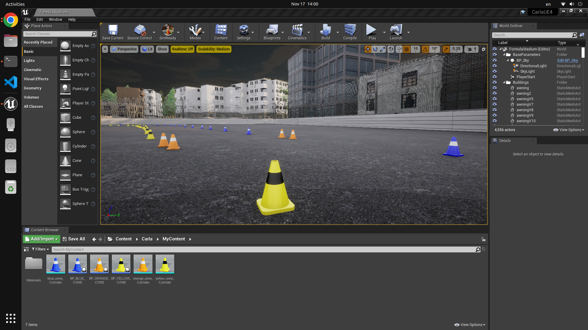
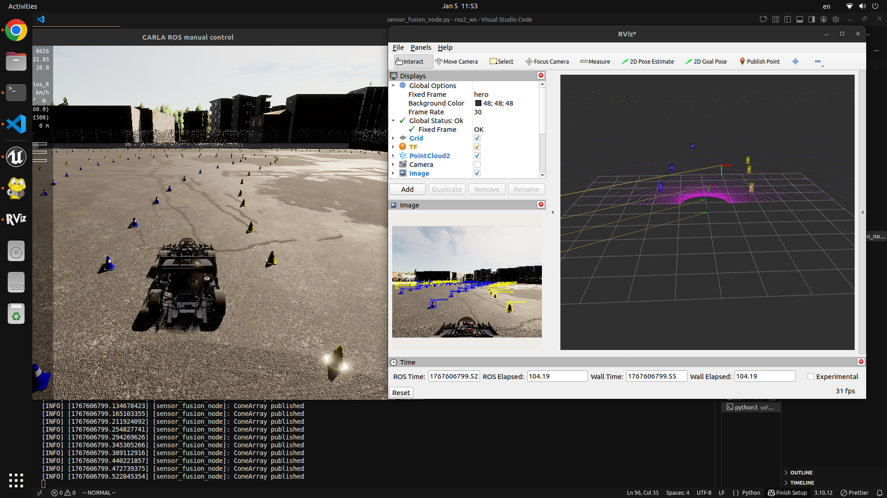
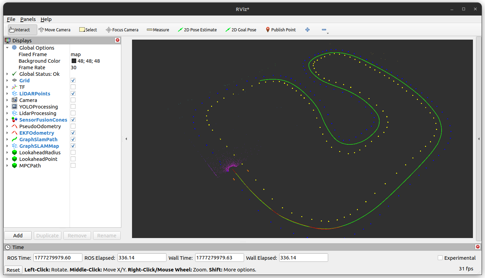
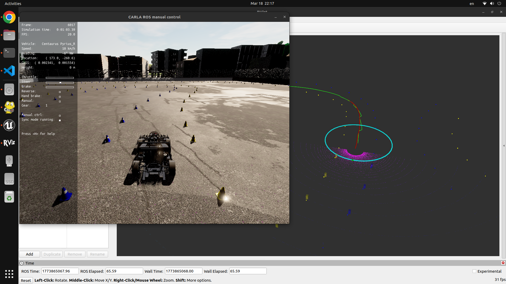
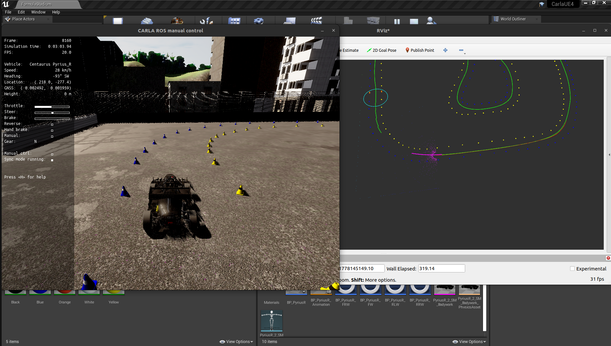

# Formula Student Driverless (FSD) Autonomous Racing Stack

> **A complete ROS 2 autonomous racing pipeline designed for unknown track navigation at the physical limits of the vehicle. The localization and mapping stack relies on YOLOv8-LiDAR sensor fusion and EKF (IMU-GNSS) backed GraphSLAM localization. Navigation is handled in two phases: an initial exploration lap using Delaunay Triangulation, B-splines and Pure Pursuit/PID, followed by an optimization lap utilizing a line optimizer, velocity profiler and Model Predictive Control (MPC).**

## About the Project
This repository contains the software stack developed for my master's thesis on autonomous racing path planning under Formula Student rules. The inspiration behind this topic stems from my time as a member of the **Centaurus Racing Team** at the **University of Thessaly** (Volos, Greece). The system architecture, mathematical implementation and code within this repository represent my own independent research and development.

The system is designed to drive an autonomous vehicle through an unknown track using a dual-phase approach: an initial **Exploration Lap** to safely map the environment, followed by an **Optimization Lap** that computes and executes the absolute physical limits of the vehicle.


*The custom Formula Student track environment built within the CARLA Simulator.*

---

## System Architecture
The pipeline is built on **ROS 2** and tested in the **CARLA Simulator**. The autonomous navigation relies on a core sensor suite consisting of an **RGB Camera** and a **180° LiDAR** for perception, coupled with an **IMU** and **GNSS** for localization. The software stack is divided into four main subsystems:

### 1. Perception

*YOLOv8 bounding boxes (bottom left) fused with 3D Lidar point clouds in RViz.*

+ **Camera Detection:** Utilizes YOLOv8 (trained offline on the FSOCO dataset) to detect and classify cones (Yellow, Blue, Orange) in 2D image space.
+ **LiDAR Perception:** Process raw point clouds using PCL (PassThrough filtering, RANSAC ground removal and Euclidean Clustering) to extract 3D cone centroids.
+ **Sensor Fusion:** Projects 3D LiDAR centroids onto the 2D camera plane using the pinhole camera model, assigning YOLO color classifications to the physical LiDAR points.

### 2. Localization and Mapping

*The track map generated by the custom GraphSLAM engine.*
+ **Extended Kalman Filter (EKF):** Fuses high-frequency IMU data with low-frequency GNSS data
+ **GraphSLAM:** A custom 2D Pose Graph SLAM engine built from scratch using Eigen and Cholesky decomposition (SimplicialLDLT). It tracks cone color probabilities using a recursive Bayes filter and optimizes the track map upon loop closure.

### 3. Path Planning

*Lap 1 Exploration: Generating a safe centerline and calculating the lookahead target.*

+ **Phase 1 - Exploration (Lap 1):** Uses Bowyer-Watson Delaunay Triangulation to extract safe track boundaries and a drivable centerline. The centerline is smoothed using Uniform Cubic B-Splines.
+ **Phase 2 - Optimization (Lap 2+):** An Elastic Band Line Optimizer pulls the trajectory toward the apex of corners. A Velocity Profiler calculates absolute speed limits based on Menger curvature and tire friction circles.

### 4. Control

*Lap 2 Optimization: The MPC predicting the optimal trajectory.*

+ **Exploration Control:** Geometric Pure Pursuit for lateral control and a PID controller for longitudinal speed tracking.
+ **Optimization Control (MPC):** An OSQP-Eigen driven Model Predictive Controller utilizing a kinematic bicycle model. It strictly enforces physical actuator limits (steering angle, max acceleration/deceleration) while following the optimal speed profile.

---

## Repository Structure
```txt
autonomous-racing-fsd/
├── carla_setup/                  # CARLA sensor configs and bridge launch scripts
│   ├── objects.json
│   ├── run_bridge.sh
│   └── unfreeze_carla.py
├── images/                       # Documentation screenshots
├── offline_training/             # YOLOv8 dataset prep, training, and weights
│   ├── dataset_tools/
│   ├── weights/                  # Contains best.pt
│   └── train.py
└── src/                          # ROS 2 Workspace
    ├── bringup/                  # Master launch files
    ├── camera_detection/         # YOLOv8 ROS 2 node
    ├── interfaces/               # Custom Cone and ConeArray messages
    ├── lidar_perception/         # PCL clustering node
    ├── localization/             # EKF, GraphSLAM, and RViz vizualization
    ├── path_planning/            # State Machine, Delaunay, MPC, Optimizers
    └── sensor_fusion/            # Camera/LiDAR projection node
```

---

## Prerequisites & Dependencies

To build and run this stack, you need the following environment:
+ **OS:** Ubuntu 22.04
+ **ROS 2**: Humble
+ **Simulator:** CARLA (Version 0.9.14+) & [`carla-ros-bridge`](https://github.com/ttgamage/carla-ros-bridge)
+ **Python Libraries:** `ultralytics`, `scipy`, `numpy`, `opencv-python`
+ **C++ Libraries:** Eigen3, PCL

### Manual Installation Required: OsqpEigen

The Model Predictive Controller relies on the `OsqpEigen` library, which cannot be installed automatically via ROS `rosdep`. You must build it from source before compiling this workspace.

For full documentation and troubleshooting, visit the official repository: [gbionics/osqp-eigen](https://github.com/gbionics/osqp-eigen.git).

Run the following commands outside the ROS workspace to install it:

```bash
git clone https://github.com/gbionics/osqp-eigen.git
cd osqp-eigen
mkdir build && cd build
cmake -DCMAKE_INSTALL_PREFIX:PATH=<custom-folder> ../
make
make install
```

---

## Configuration Notes (Read Before Running)
Because this is an active research repository, certain configurations are currently hardcoded to a specific local machine setup. **You must update these paths in the source code before building the project.**

For instance:
1. **YOLO Weights Path:** In `src/camera_detection/camera_detector_node.py`, update `MODEL_PATH` to point your local `best.pt` file.
2. **Telemetry CSV Paths:** In `src/path_planning/src/state_machine_node.cpp`, update the string variables `filename` and the `telemetry_file.open()` path to point to valid directories on your machine where the node has write permissions.
3. **Vehicle Spawn & Sensor Configuration:** The `carla_setup/objects.json` file contains the hardcoded starting coordinates for the vehicle, as well as the relative spatial transforms for all sensors (RGB camera, LiDAR, IMU). If you test on a different CARLA map or use a different vehicle chassis, you must update these coordinates accordingly to ensure safe spawning and accurate sensor fusion
4. **Vehicle Kinematics (Wheelbase):** The controllers rely on a hardcoded wheelbase (`L = 1.6` meters). If you change the vehicle model in CARLA, you must update this constant in both `src/path_planning/src/control/mpc_controller.hpp` and `src/path_planning/src/control/pure_pursuit.hpp` to ensure accurate steering geometry.

Moreover, all ROS 2 topic names used are hardcoded to the local machine setup. You must update **ALL** the topic names before trying to run the project; otherwise, the appropriate messages will not be received or sent.

---

## Installation & Usage

1. Clone the repository:
```bash
git clone https://github.com/ddiannelos/autonomous-racing-fsd
cd autonomous-racing-fsd
```

2. Build the workspace: Use the provided bash script to automatically resolve ROS 2 dependencies and build the packages.
```bash
chmod +x setup.sh
./setup.sh
```

3. Launch the Stack: You will need three terminals.

**Terminal 1:** Launch CARLA Simulator and press play on the appropriate map.

**Terminal 2:** Launch the carla-ros-bridge. First copy the three files inside the `carla_setup/` folder (`objects.json`, `run_bridge.sh` and `unfreeze_carla.py`) directly into the root folder of your `carla-ros-bridge` installation. Then run the bridge from there:
```bash
cd /path/to/your/carla-ros-bridge
chmod +x run_bridge.sh
./run_bridge.sh
```

**Terminal 3:** Launch the FSD ROS 2 pipeline.
```bash
source install/setup.bash
ros2 launch bringup simulation.launch.py
```

### Offline Perception Training (YOLOv8)
If you wish to retrain the YOLOv8 cone detection model from scratch or test its inferences on static images, you can use the provided scripts in the `offline_training` directory.

**1. Prepare the Training Workspace:**

Create a dedicated folder anywhere on your machine for the dataset and copy the provided training scripts (files inside `offline_training/`) into it.
```bash
mkdir ~/fsoco_training_ws
cd ~/fsoco_training_ws

# Copy the scripts from the repository to the new workspace
cp -r /path/to/autonomous-racing-fsd/offline_training/* .
```

**2. Setup the ML Environment:**
Install the required Python packages (it is recommended to use a virtual environment like `conda` or `venv` to avoid conflicting with ROS 2 dependencies).

```bash
pip install -r requirements.txt
```

**3. Prepare the Dataset:**

Ensure you have downloaded the raw [FSOCO dataset](https://www.kaggle.com/datasets/dellagiustinalorenzo/fsoco-bounding-boxes-yolo) into a folder named `fsoco_dataset` inside your training workspace. Run the splitting script to randomly divide the images and labels into `train` and `val` sets (80/20 split):
```bash
python3 dataset_tools/split_data.py
```

**4. Train the Model:**

Execute the training script. This will download the base `yolov8n.pt` weights and begin training on the `fs_dataset`.
```bash
python3 train.py
```

*Note: The training artifacts and best weights will be saved automatically in the cone_detection directory*

**5. Test Predictions:**

To verify the model's accuracy, run the prediction script. It will randomly sample 10 images from your validation set, draw the bounding boxes, and save the output images to a `predictions/` folder.
```bash
python3 predict.py
```

### Shutting Down the Simulation

To safely stop the simulation without freezing the CARLA server, follow this exact order:

1. **Terminal 3 (FSD Pipeline):** Press `Ctrl + C` to stop the autonomous nodes.
2. **Terminal 2 (ROS Bridge):** Press `Ctrl + C` to trigger the `unfreeze_carla.py` to return the simulation to asynchronous mode.
3. **Terminal 1 (CARLA):** Open the CARLA simulator and press stop to the simulation or press `Ctrl + C` to shut down the simulator.

---

## Acknowledgments
+ **Centaurus Racing Team:** A proud nod to my time with the team at the University of Thessaly. The collaborative environment and high-performance engineering culture provided the practical motosport knowledge that drove me to pursue this individual thesis.
+ **Open Source Tools:** This project relies heavily on [CARLA Simulator](https://carla.org/), [carla-ros-bridge](https://github.com/ttgamage/carla-ros-bridge), [Ultralytics YOLOv8](https://docs.ultralytics.com/models/yolov8#supported-tasks-and-modes), the [FSOCO Dataset](https://www.kaggle.com/datasets/dellagiustinalorenzo/fsoco-bounding-boxes-yolo) and [GBionics OSQP-Eigen](https://github.com/robotology/osqp-eigen.git)

---

## License
This project is licensed under the Apache 2.0 License. See the `LICENSE` file for details.


